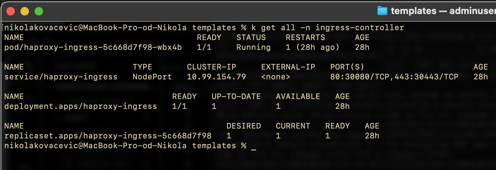
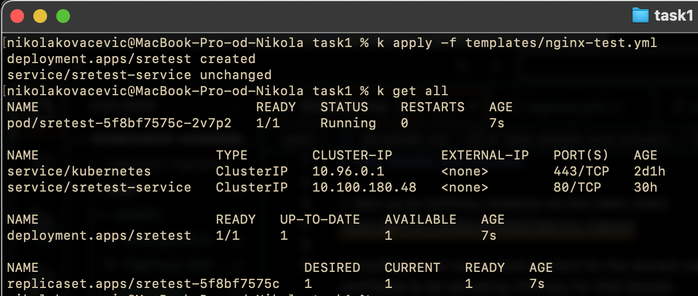
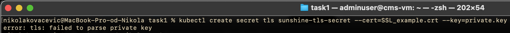
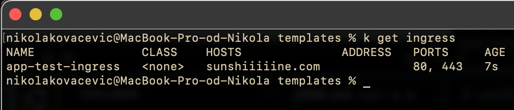
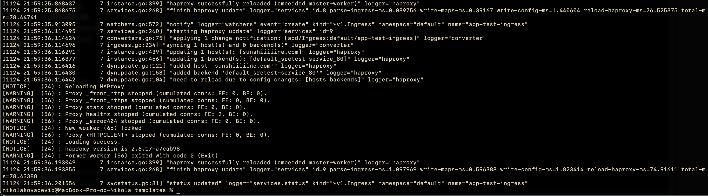
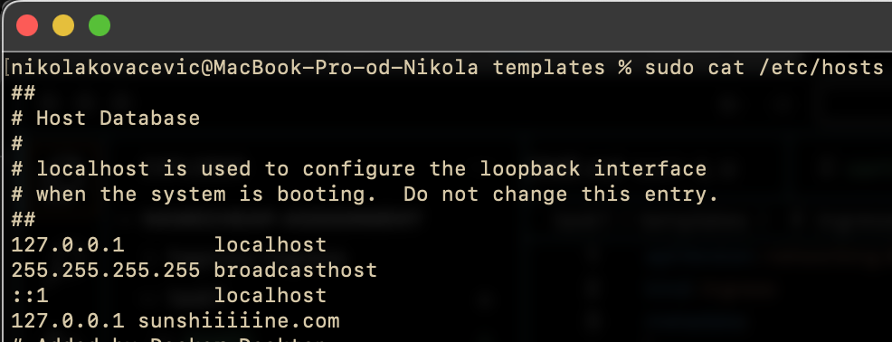
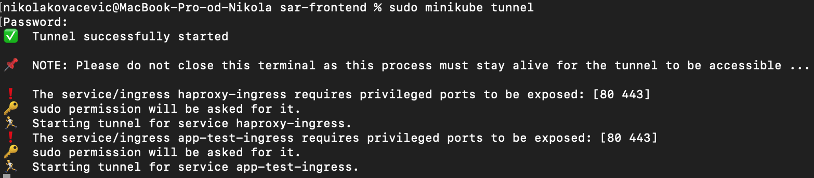
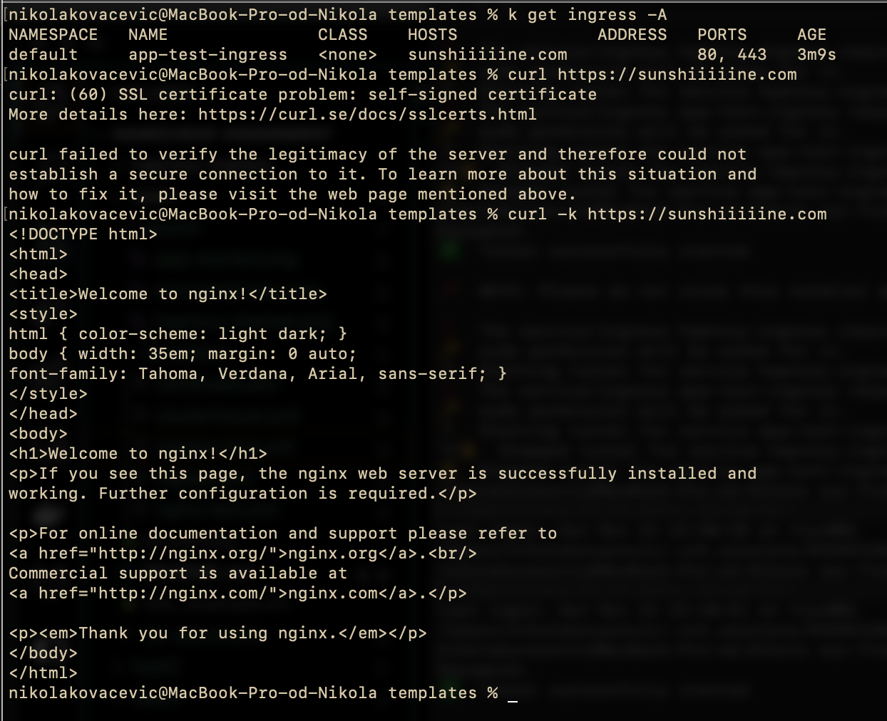

# Task details and solution

1. Spin up an HAProxy instance via this [Helm chart](https://github.com/jcmoraisjr/haproxy-ingress)

2. Configure it to serve some content for the domain name sunshiiiiine.com (locally would be enough) and add the provided SSL/TLS certificate to be served by HAProxy for that domain.

Once you have a successfully secured domain name served in browser - describe the steps you performed to reach it. In such a case we accept for a desired outcome some connection logs (cURL etc.) and also the text explanations of steps that led you to success.

## Task completion steps

- Install Kubernetes(minikube) and Helm
- Clone [Helm chart](https://github.com/jcmoraisjr/haproxy-ingress)
- Create local Docker image for the chart to use

```bash
make docker-build
```

- Run "minikube image load haproxy-ingress:latest" to load the custom image in minikube environment

- Deploy the Helm chart into the cluster

```bash
helm repo add haproxy-ingress https://haproxy-ingress.github.io/charts
helm install haproxy-ingress haproxy-ingress/haproxy-ingress\
  --create-namespace --namespace=ingress-controller\
  --set controller.image.repository=localhost/haproxy-ingress\
  --set controller.image.tag=latest\
```

- Verify the Ingress controller has started



- Deploy test nginx app into the cluster



- Create Kubernetes secret for TLS --> stuck - the key is encrypted



- Create and deploy Ingress object connecting to HAproxy Ingress controller and pointing traffic to app container(nginx)

- Domain sunshiiiiine.com resolves to IP: 162.255.118.67 - update /etc/hosts file for local resolution to localhost

- Run "minikube tunnel" to expose the services (HAProxy service of type LoadBalancer is assigned local IP)

## Task solution with different certificate

- In order to bypass the certificate issue, I will solve the task the same way, only using different certificate. I will use self-signed certificate from LetsEncrypt. In the templates/ folder there is clusterissuer.yml and certificate.yml config.

### Task solution details

- Created test ingress (ingress-test.yml)



- Check HAProxy logs to check ingress connection to ingress controller



- Update /etc/hosts file



- Run "minikube tunnel" to connect HAProxy to local IP



- Check connection to the test nginx service using curl



### Additional points

- Store all secrets in a secure manner
- In case of GitOps approach, encrypt secrets before commiting them to repository
