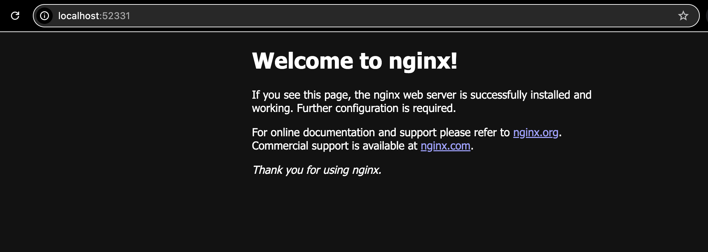

# Task details and solution

## A Riddle from the Sphinx about Nginx

Again use any convenient local K8s cluster, and use the provided 'nginx_example.yaml' file to create resources of a simple webserver. Oops, looks like you need to fix some issues for application to run. The success in this case is to access Nginx page in the browser.

Desired result:
Provide us with a working 'nginx.yaml' file with your corrections, share some explanation text with description of your findings, problems that you found and ways how you fix and/or avoid them. If you wish to share any screenshots, commands used during investigation or logs you spotted - feel free to do it as well for sure!

## Corrections made

- Updated the label in the service to match the label in the pod
- Correctly labeled the minikube node to satisfy node affinity rules

```bash
kubectl label nodes minikube node-role.kubernetes.io/application=sretest
```

## Access details

- After correction, verify that the pod has started:


- Check minikube URL:


- Access URL in the browser:


- Check pod logs after start:


## Next steps

- Remove NodePort service and implement LoadBalancer and Ingress to access the application
- Use a specific nginx image version (to ensure stability and unwanted updates)
- Use lightweight nginx image (if it satisfies app requirements) to save memory
- Re-evaluate needed resource requests and limits under load
- Add liveness and readiness probes
