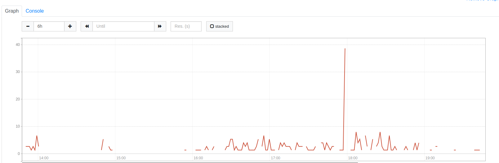

# Task details and solution

PROMising SeQueL
We are showing a Prometheus alert example below, please check it along with the attached screenshot example and answer the following questions:

```
- alert: MysqlTransactionDeadlock
expr: increase(mysql_global_status_innodb_row_lock_waits[2m]) > 0
for: 3m
labels:
    severity: warning
annotations:
    summary: 'Mysql Transaction Waits'
    description: 'There are `{{ $value | humanize }}` MySQL connections waiting for a stale transaction to release.'
```



## Questions

1. How would you investigate the root cause of this alert?

- In order to investigate the root cause of the alert, we have to check the MySQL and InnoDB status at the time of the alert rising. To do that, I would first check the logs of the MySQL pod. If no relevant errors are displayed, I would get access to the pods' shell and check specific error logs (if they are too big, refine the search using 'grep'). After reviewing the logs, I would look into the InnoDB engine and look at the status using shell commands. If we have some Application monitoring tool (e.g NewRelic), I would check which queries have the potential of locking multiple rows causing the alert to trigger. Regarding the spike in the alert, I would look if there are batch jobs or cronjobs running at the time which could cause a lock on many rows. It is visible from the graph that the alert is more active from 16:00 to 19:00. That may indicate that overall application traffic is significantly higher at that time, and if it occurs on a daily basis it should be resolved by scaling the resources or caching some of the data at that specific period.

2. Would you recommend any changes to the alert configuration for improved usability, readability, or response time? If so, what changes and why?

- As it is visible from the graph, it is likely that the short spikes are caused because of overall increase in traffic, and the system seems to handle it with minor issues (the spikes rise and fall quickly). In that case, the alert should not trigger on these small spikes. The alert should trigger only if the spike is too big and persists for some time. It should respond quicker than the given 3 minutes. In order to satisfy these conditions, we have to increase the number that the metric has to increase, and reduce the period. Also, I would update the description for better readability. Here is an example of what the improved alert would look like:

```
alert: MysqlTransactionRowLock
expr: increase(mysql_global_status_innodb_row_lock_waits[2m]) > 10
for: 1m
labels:
  severity: warning
annotations:
  summary: 'MySQL Row Lock Spike Detected'
  description: 'There has been a significant increase in MySQL row lock waits for more than 1 minute. This could indicate lack of resources or locking issues.'
```

3. Based on the attached alert screenshot, how would you modify the alert to reduce potential fatigue (if at all)? Justify your response.

- To reduce potential alert fatigue, we have to avoid as many false positives as possible. The update which could help is prolonging the period to trigger the alert, because as it is shown in the screenshot, the issues get resolved quickly. In addition, to keep the alert responsive enough, we can combine the provided metric with other metrics to make sure we trigger alerts only in case of a critical incident.

4. Can you suggest an alternative MySQL-related metric that could be used to enhance this alert?

In order to make the alert more robust, we can use alternative metrics. Alternative metrics I would suggest are:

- mysql_global_status_innodb_deadlocks - to check whether a deadlock has appeared
- mysql_global_status_innodb_row_lock_time - checking the average or the increase of the row lock time. If the time the rows are being locked for is too big, it could reflect an issue in the system.
- mysql_global_status_innodb_lock_waits - checking total number of locks happening in the system. A big increase in total locks could be a useful indicator.
- mysql_global_status_queries - by using this metric we can check whether the increase in row locks during a specific time period is caused by an increase of total queries reaching the DB.
